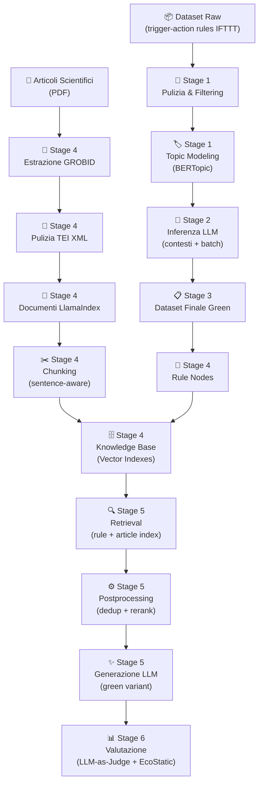

# 🌿 Green Rule RAG

Un sistema basato su **Retrieval-Augmented Generation (RAG)** per la generazione di varianti sostenibili di regole trigger-action nel dominio della smart home.

Data una regola domotica espressa in linguaggio naturale (es. *"IF You exit from home THEN Turn off lights"*), il sistema recupera conoscenza rilevante da una knowledge base costruita su articoli scientifici e regole green pre-catalogate, e genera una versione più sostenibile della regola originale, valutandone infine la qualità attraverso un'eco-metrica strutturata.

---

## Indice

- [Panoramica della Pipeline](#panoramica-della-pipeline)
- [Architettura del Progetto](#architettura-del-progetto)
- [Struttura della Repository](#struttura-della-repository)
- [Stage 1 — Pulizia del Dataset](#stage-1--pulizia-del-dataset-01-cleaning)
- [Stage 2 — Inferenza LLM](#stage-2--inferenza-llm-02-inference)
- [Stage 3 — Dataset Finale](#stage-3--dataset-finale-03-finaldataset)
- [Stage 4 — Estrazione e Costruzione della Knowledge Base](#stage-4--estrazione-e-costruzione-della-knowledge-base-04-extracttext)
- [Stage 5 — RAG Pipeline](#stage-5--rag-pipeline-05-retrieval)
- [Stage 6 — Valutazione con Eco-Metrica](#stage-6--valutazione-con-eco-metrica-06-evaluation)
- [Dati](#dati)
- [Tecnologie Utilizzate](#tecnologie-utilizzate)
- [Installazione](#installazione)
- [Configurazione](#configurazione)

---

## Panoramica della Pipeline



---

## Architettura del Progetto

Il progetto è organizzato in **6 stage sequenziali**, ciascuno corrispondente a una cartella numerata in `src/`:

| Stage | Cartella | Scopo |
|-------|----------|-------|
| 1 | `01-Cleaning` | Filtraggio del dataset raw, topic modeling con BERTopic, suddivisione in batch per topic |
| 2 | `02-Inference` | Inferenza LLM per generare contesti topic-level e annotare ogni regola (green relevance, IF-THEN rewriting) |
| 3 | `03-FinalDataset` | Assemblaggio del dataset finale delle regole green (filtraggio per relevance medium/high, deduplicazione) |
| 4 | `04-ExtractText` | Estrazione testo da articoli PDF (GROBID), pulizia TEI, costruzione documenti, chunking, indicizzazione vettoriale |
| 5 | `05-Retrieval` | Pipeline RAG completa: retrieval, postprocessing (dedup + cross-encoder rerank), generazione della regola green |
| 6 | `06-Evaluation` | Valutazione con LLM-as-Judge e eco-metrica deterministica (EcoStatic) |

---

## Struttura della Repository

```
smart-home-green-rag/
├── src/
│   ├── 01-Cleaning/
│   │   └── 03_split_topics_into_batches.py
│   ├── 02-Inference/
│   │   ├── 01-generate_topic_contexts.py
│   │   ├── 02-infer_topic_batches.py
│   │   ├── prompt_context.txt
│   │   └── prompt_batch.txt
│   ├── 03-FinalDataset/
│   │   └── 01-build_final_green_dataset.py
│   ├── 04-ExtractText/
│   │   ├── extract_grobid.py
│   │   ├── clean_grobid_tei.py
│   │   ├── build_documents.py
│   │   ├── build_nodes.py
│   │   ├── build_rules_nodes.py
│   │   ├── build_knowledge_base.py
│   │   ├── build_vector_indexes.py
│   │   └── visualize_knowledge_base.py
│   ├── 05-Retrieval/
│   │   ├── run_rag_pipeline.py
│   │   └── rag_pipeline/
│   │       ├── config.py
│   │       ├── clients.py
│   │       ├── retrieval.py
│   │       ├── postprocessing.py
│   │       ├── generation.py
│   │       ├── display.py
│   │       ├── run_io.py
│   │       ├── node_utils.py
│   │       └── pipeline.py
│   └── 06-Evaluation/
│       ├── 01-build_eval_inputs.py
│       ├── 02-run_llm_judge.py
│       ├── 03-validate_judgments.py
│       ├── judge_prompt.txt
│       └── judge_schema.json
├── notebooks/
│   └── 01-Cleaning/
│       ├── 01_raw_dataset_filtering.ipynb
│       └── 02_topic_modeling_bertopic.ipynb
├── data/
│   ├── dataset-rules/
│   │   ├── raw/                 # Dataset originale
│   │   ├── processed/           # Dataset filtrato e clusterizzato
│   │   ├── taxonomies/          # Tassonomie dei canali
│   │   ├── batch/               # Batch per topic (input per LLM)
│   │   ├── final_batch/         # Output LLM con contesti e annotazioni
│   │   └── final_dataset/       # Dataset green finale + rule nodes
│   ├── articles/
│   │   ├── pdfs/                # PDF degli articoli scientifici
│   │   ├── articles-metadata/   # Metadati JSON per articolo
│   │   ├── extracted_grobid_tei/# TEI XML estratti da GROBID
│   │   ├── cleaned_blocks/      # Blocchi JSONL puliti
│   │   ├── supplementary_blocks/# Blocchi supplementari (glossari, box)
│   │   ├── table_blocks/        # Tabelle estratte
│   │   ├── discarded_blocks/    # Blocchi scartati (diagnostica)
│   │   ├── review_blocks/       # Blocchi da review manuale
│   │   ├── cleaning_reports/    # Report di pulizia per articolo
│   │   ├── documents_preview/   # Preview dei documenti LlamaIndex
│   │   └── nodes_preview/       # Preview dei nodi chunk
│   └── retrieval_runs/          # Output delle run RAG
├── utils/
│   └── dataset_group_by.py
├── requirements.txt
└── README.md
```

---

## Stage 1 — Pulizia del Dataset (`01-Cleaning`)

### Obiettivo
Partendo dal dataset raw di regole trigger-action (derivate da IFTTT), filtrare e organizzare le regole rilevanti per il dominio smart home, raggruppandole tematicamente.

### Processo

1. **Filtraggio del dataset raw** (`notebooks/01-Cleaning/01_raw_dataset_filtering.ipynb`)
   - Caricamento del dataset grezzo (`data/dataset-rules/raw/dataset_raw.csv`)
   - Mapping dei canali con una tassonomia (`channel_class_mapping.csv`)
   - Classificazione delle regole in tre scope: `core_smart_home`, `context_aware_smart_home`, `smart_home_related`
   - Filtraggio delle regole non pertinenti
   - Output: `data/dataset-rules/processed/dataset_candidates_rag.csv`

2. **Topic modeling con BERTopic** (`notebooks/01-Cleaning/02_topic_modeling_bertopic.ipynb`)
   - Clustering tematico delle regole tramite BERTopic
   - Assegnazione di topic ID e topic name a ogni regola
   - Output: dataset con cluster tematici

3. **Suddivisione in batch per topic** (`src/01-Cleaning/03_split_topics_into_batches.py`)
   - Generazione di ID stabili per sample (`T024_S0001`) e topic (`T024`)
   - Suddivisione in batch da massimo 100 regole per topic
   - Esportazione solo delle colonne necessarie all'LLM: `sample_id`, `topic_name`, `topic_text`
   - Output: `data/dataset-rules/batch/topic_*/topic_*_batch_*.csv` + manifest

---

## Stage 2 — Inferenza LLM (`02-Inference`)

### Obiettivo
Utilizzare un LLM (GPT-4o-mini via OpenRouter) per arricchire il dataset con annotazioni strutturate: contesto del topic, riscrittura IF-THEN, green relevance e decisione di inclusione.

### Processo

1. **Generazione dei contesti topic-level** (`01-generate_topic_contexts.py`)
   - Per ogni cluster BERTopic, campiona N regole rappresentative
   - L'LLM analizza i campioni e produce un contesto stabile per il topic:
     - `llm_topic_name` — nome funzionale del topic
     - `topic_summary` — descrizione del contenuto del topic
     - `green_category` — categoria green in snake_case (es. `hvac_optimization`, `lighting_efficiency`)
     - `global_green_relevance` — rilevanza green globale: `high`, `medium`, `low`, `none`
   - Output strutturato validato via JSON Schema
   - Output: `data/dataset-rules/final_batch/topic_*/topic_*_context.json`

2. **Inferenza batch per regola** (`02-infer_topic_batches.py`)
   - Per ogni regola nel batch, utilizzando il contesto del topic:
     - Riscrittura in formato IF-THEN pulito
     - Assegnazione di `green_relevance` a livello di singola regola
     - Decisione `keep_for_rag`: true/false
   - Output: `data/dataset-rules/final_batch/topic_*/topic_*_batch_*.json`

### Prompt
- **System prompt contesto** (`prompt_context.txt`): definisce i criteri di green relevance e le istruzioni per l'analisi topic-level
- **System prompt batch** (`prompt_batch.txt`): definisce le istruzioni per la riscrittura IF-THEN e la classificazione per singola regola

### Modello e API
- **Modello**: `openai/gpt-4o-mini` (via OpenRouter)
- **Temperatura**: 0 (output deterministico)
- **Formato output**: JSON Schema strict

---

## Stage 3 — Dataset Finale (`03-FinalDataset`)

### Obiettivo
Assemblare il dataset finale delle regole green, filtrando solo quelle con rilevanza `medium` o `high` e deduplicandole.

### Processo (`01-build_final_green_dataset.py`)
1. Raccolta di tutti i file JSON di batch da `data/dataset-rules/final_batch/`
2. Estrazione delle regole con `green_relevance` ∈ {`medium`, `high`}
3. Deduplicazione esatta sulla colonna `if_then_rule`
4. Colonne finali: `sample_id`, `llm_topic_name`, `green_category`, `if_then_rule`
5. Output: `data/dataset-rules/final_dataset/green_rules_final_dataset.json`

### Green Categories
Le categorie green normalizzate utilizzate nel progetto sono 9:

| Categoria | Descrizione |
|-----------|-------------|
| `lighting_efficiency` | Ottimizzazione dell'illuminazione |
| `occupancy_based_control` | Controllo basato su occupazione/presenza |
| `hvac_optimization` | Ottimizzazione riscaldamento/raffrescamento |
| `appliance_energy_management` | Gestione energetica degli elettrodomestici |
| `environmental_awareness` | Consapevolezza ambientale (sensori, meteo) |
| `comfort_security` | Comfort e sicurezza |
| `water_saving` | Risparmio idrico |
| `scheduling_optimization` | Ottimizzazione della schedulazione |
| `standby_reduction` | Riduzione dei consumi in standby |

---

## Stage 4 — Estrazione e Costruzione della Knowledge Base (`04-ExtractText`)

### Obiettivo
Estrarre il testo dagli articoli scientifici (PDF), pulirlo, suddividerlo in chunk e costruire i vector index della knowledge base.

### Sotto-pipeline degli Articoli

#### 4a. Estrazione GROBID (`extract_grobid.py`)
- Invio dei PDF degli articoli al server GROBID locale (`http://localhost:8070`)
- Estrazione come TEI XML arricchito con:
  - Coordinate PDF per ogni elemento
  - Segmentazione a livello di frase
  - ID XML generati
- Output: `data/articles/extracted_grobid_tei/*.grobid.tei.xml`

#### 4b. Pulizia TEI (`clean_grobid_tei.py`)
Pipeline di pulizia approfondita del TEI XML estratto:
- **Classificazione dei blocchi**: ogni paragrafo viene classificato come `main`, `supplementary`, `discard` o `review`
- **Filtri applicati**:
  - Rimozione sezioni amministrative (references, acknowledgments, funding, etc.)
  - Rimozione boilerplate editoriale, caption di figure/tabelle, testo da grafici
  - Rilevamento e isolamento di table leakage (testo tabellare che GROBID classifica erroneamente come paragrafo)
  - Separazione di blocchi supplementari (glossari, highlights, box, case study)
- **Normalizzazione del testo**: Unicode NFKC, rimozione soft hyphen, collasso degli spazi
- **Selezione dell'abstract**: algoritmo di scoring multi-criterio con gestione di abstract multipli/ambigui
- Output:
  - `data/articles/cleaned_blocks/*.jsonl` — blocchi canonici per la RAG
  - `data/articles/supplementary_blocks/*.jsonl` — blocchi supplementari
  - `data/articles/cleaning_reports/*.json` — report diagnostici

#### 4c. Costruzione Documenti (`build_documents.py`)
- Costruzione di oggetti `Document` LlamaIndex dai blocchi JSONL puliti
- Integrazione dei metadati dell'articolo (`articles-metadata/*.json`):
  - Titolo, anno, URL, summary
  - Green categories one-hot encoding (9 categorie)
- Configurazione dei metadata keys esclusi da embedding e LLM context
- Output: documenti LlamaIndex in memoria + preview JSON

#### 4d. Chunking — Costruzione Nodi (`build_nodes.py`)
- Raggruppamento dei blocchi per sezione dell'articolo
- Creazione di un `Document` LlamaIndex per sezione con `header_path` gerarchico
- Suddivisione sentence-aware tramite `SentenceSplitter`:
  - **Chunk size**: 512 token
  - **Overlap**: 64 token
- Ogni nodo conserva: metadati di sezione, posizione nell'articolo, pagine sorgente, link al chunk precedente/successivo
- Output: nodi chunk in memoria + preview JSON

### Sotto-pipeline delle Regole

#### 4e. Rule Nodes (`build_rules_nodes.py`)
- Caricamento del dataset green normalizzato (`green_rules_final_dataset_normalized.json`)
- Costruzione di `TextNode` LlamaIndex per ogni regola:
  - **Testo**: `Green category: X\nTopic: Y\nRule: IF ... THEN ...`
  - **Metadati**: `content_type=green_rule`, `rule_id`, `llm_topic_name`, `green_category`, `if_then_rule`, green categories one-hot
- Deduplicazione degli ID dei nodi
- Output: `data/dataset-rules/final_dataset/rule_nodes.jsonl`

### Indicizzazione Vettoriale

#### 4f. Knowledge Base completa (`build_knowledge_base.py`)
Script orchestratore che esegue l'intera pipeline in memoria:
1. Costruisce i documenti articolo e i nodi chunk con metadati green
2. Costruisce i rule nodes
3. Crea due indici vettoriali separati:
   - **Article Index**: chunk di articoli scientifici (`data/knowledge_base/article_index/`)
   - **Rule Index**: regole green del dataset (`data/knowledge_base/rule_index/`)
4. **Embedding model**: `intfloat/e5-base-v2` (HuggingFace, locale)
5. Opzione di test retrieval integrato

#### 4g. Visualizzazione (`visualize_knowledge_base.py`)
- Riduzione dimensionale degli embedding (UMAP o PCA) a 3D
- Visualizzazione interattiva con Plotly
- Colorazione per `green_category`, `source` o `content_type`
- Output: HTML interattivo + CSV + report JSON

---

## Stage 5 — RAG Pipeline (`05-Retrieval`)

### Obiettivo
Dato una regola trigger-action in input, recuperare contesto rilevante dalla knowledge base e generare una variante green migliorata.

### Processo (`run_rag_pipeline.py` → `rag_pipeline/pipeline.py`)

La pipeline RAG si articola in 3 fasi:

#### 5a. Retrieval (`retrieval.py`)
- Caricamento degli indici vettoriali persistiti (article + rule)
- Retrieval per similarità dalla query:
  - **Rule Index** → top-k regole simili (default: k=10)
  - **Article Index** → top-k chunk di articoli (default: k=15)
- **Embedding model**: `intfloat/e5-base-v2`

#### 5b. Postprocessing (`postprocessing.py`)
- **Regole**: deduplicazione testuale con SequenceMatcher (soglia: 0.88) → selezione top-3
- **Articoli**:
  - Rimozione chunk troppo corti (< 150 caratteri)
  - **Reranking** con cross-encoder `cross-encoder/ms-marco-MiniLM-L-6-v2`
  - Selezione top-5 dopo rerank

#### 5c. Generazione (`generation.py`)
- Costruzione del prompt RAG con:
  - Regola originale
  - Regole simili selezionate (con score di retrieval e rerank)
  - Chunk di articoli selezionati
- Invocazione dell'LLM via **Ollama** (modello: `gpt-oss:20b`, temperatura: 0.2)
- Output JSON strutturato:
  ```json
  {
    "original_rule": "IF You exit from home THEN Turn off lights.",
    "improved_rule": "IF You exit from home AND no one else is home THEN Turn off all lights and reduce thermostat to eco mode.",
    "green_strategy": "occupancy_based_shutdown",
    "preserved_intent": true,
    "explanation": "...",
    "used_context_ids": ["RULE_1", "ARTICLE_2"]
  }
  ```
- I risultati di ogni run vengono salvati in `data/retrieval_runs/run_XXX/`

---

## Stage 6 — Valutazione con Eco-Metrica (`06-Evaluation`)

### Obiettivo
Valutare automaticamente la qualità delle regole green generate, utilizzando un LLM-as-Judge e un'eco-metrica deterministica.

### Processo

#### 6a. Costruzione input di valutazione (`01-build_eval_inputs.py`)
- Accoppiamento di ogni regola originale con la sua variante green generata
- Output: `data/dataset-rules/evaluation/eval_inputs.jsonl`

#### 6b. LLM-as-Judge (`02-run_llm_judge.py`)
- Per ogni coppia (regola originale r, variante green r'), un LLM giudice valuta 6 feature score + 2 validity check:

| Feature Score | Range | Descrizione |
|---------------|-------|-------------|
| `OccupancyScore` | 0-2 | Uso della presenza/occupazione |
| `EnvConditionScore` | 0-1 | Uso di condizioni ambientali (luce, temperatura, meteo) |
| `DurationScore` | 0-1 | Presenza di auto-off o limite temporale |
| `SchedulingScore` | 0-2 | Scheduling temporale, ore di basso costo |
| `StandbyScore` | 0-2 | Logica anti-spreco standby |
| `ApplianceScore` | 0-2 | Gestione energetica smart di elettrodomestici |

| Validity Check | Valori | Descrizione |
|----------------|--------|-------------|
| `IntentPreserved` | 0/1 | La variante preserva l'intento funzionale |
| `ComfortSafetyPenalty` | 0/1 | La variante introduce rischi comfort/sicurezza |

#### 6c. Calcolo Eco-Metrica (deterministico)
A partire dai feature score, vengono calcolati deterministicamente (lato script, non LLM):

```
S_awareness = 0.6 × (OccupancyScore / 2) + 0.4 × (EnvConditionScore / 1)
S_energy    = 0.4 × (DurationScore / 1) + 0.4 × (StandbyScore / 2) + 0.1 × (ApplianceScore / 2) + 0.1 × (SchedulingScore / 2)

Δ_awareness = S_awareness(r') - S_awareness(r)
Δ_energy    = S_energy(r') - S_energy(r)

EcoStatic   = 0.5 × Δ_awareness + 0.5 × Δ_energy
```

**Label di classificazione**:

| Label | Condizione |
|-------|------------|
| `reject` | `IntentPreserved = 0` oppure `ComfortSafetyPenalty = 1` oppure `EcoStatic ≤ 0` |
| `accept` | `EcoStatic > 0` (miglioramento lieve) |
| `strong_green` | `EcoStatic ≥ 0.2` (miglioramento significativo) |

#### 6d. Validazione (`03-validate_judgments.py`)
- Verifica di integrità: schema validation, ricalcolo indipendente di EcoStatic e label
- Report statistico: distribuzione label, distribuzione EcoStatic, media per-feature, delta
- Output: `data/dataset-rules/evaluation/report.txt`

---

## Dati

### Dataset delle Regole
- **Sorgente**: regole trigger-action derivate da IFTTT
- **Dataset raw**: `data/dataset-rules/raw/dataset_raw.csv` (~13 MB)
- **Dataset finale green**: `data/dataset-rules/final_dataset/green_rules_final_dataset.json`
  - Solo regole con green relevance `medium` o `high`
  - Deduplicate e normalizzate

### Articoli Scientifici
- **30 slot** per articoli scientifici (19 attualmente compilati) documentati in `data/articles/ARTICLES.md`
- Temi coperti:
  - Smart home e sostenibilità energetica
  - Gestione energetica domestica (HVAC, illuminazione, elettrodomestici)
  - Comportamento del consumatore e risparmio energetico
  - IoT e automazione domestica green
  - Pratiche sostenibili per la casa

### Knowledge Base
Due indici vettoriali separati in `data/knowledge_base/`:
- **Article Index** — chunk di articoli scientifici arricchiti con metadati green
- **Rule Index** — regole trigger-action green normalizzate

---

## Tecnologie Utilizzate

| Componente | Tecnologia |
|------------|------------|
| **Embedding** | `intfloat/e5-base-v2` (HuggingFace, locale) |
| **Reranking** | `cross-encoder/ms-marco-MiniLM-L-6-v2` |
| **Vector Store & RAG** | LlamaIndex |
| **Generazione (inference regole)** | GPT-4o-mini (via OpenRouter) |
| **Generazione (RAG)** | Ollama (`gpt-oss:20b`) |
| **Valutazione (LLM Judge)** | GPT-4o-mini (via OpenRouter) |
| **Estrazione PDF** | GROBID |
| **Topic Modeling** | BERTopic |
| **Clustering** | HDBSCAN |
| **Riduz. Dimensionale** | UMAP |
| **Visualizzazione** | Plotly |
| **NLP** | NLTK, Sentence-Transformers, Transformers |
| **Data Processing** | Pandas, NumPy, scikit-learn |
| **Environment** | Python 3.11+, dotenv |

---

## Installazione

```bash
# Clona la repository
git clone https://github.com/rosacarota/smart-home-green-rag.git
cd smart-home-green-rag

# Crea e attiva l'ambiente virtuale
python -m venv venv
source venv/bin/activate        # Linux/macOS
venv\Scripts\activate           # Windows

# Installa le dipendenze
pip install -r requirements.txt
```

### Requisiti esterni
- **GROBID** (per l'estrazione PDF): server locale su `http://localhost:8070`
  ```bash
  docker run --rm -p 8070:8070 lfoppiano/grobid:0.8.1
  ```
- **Ollama** (per la generazione RAG): con il modello configurato in `config.py`

---

## Configurazione

### Variabili d'ambiente
Creare un file `.env` nella root del progetto:
```env
OPEN-ROUTER-KEY=sk-or-...      # API key per OpenRouter (Stage 2 e Stage 6)
```

### Parametri principali
I parametri della pipeline RAG sono configurabili in `src/05-Retrieval/rag_pipeline/config.py`:

| Parametro | Default | Descrizione |
|-----------|---------|-------------|
| `TOP_K_RULES` | 10 | Regole recuperate dal rule index |
| `TOP_K_ARTICLES` | 15 | Chunk di articoli recuperati |
| `FINAL_RULES_K` | 3 | Regole selezionate dopo postprocessing |
| `FINAL_ARTICLES_K` | 5 | Chunk selezionati dopo rerank |
| `RULE_DEDUP_SIMILARITY_THRESHOLD` | 0.88 | Soglia per deduplicazione regole |
| `LLM_TEMPERATURE` | 0.2 | Temperatura per la generazione |

---
