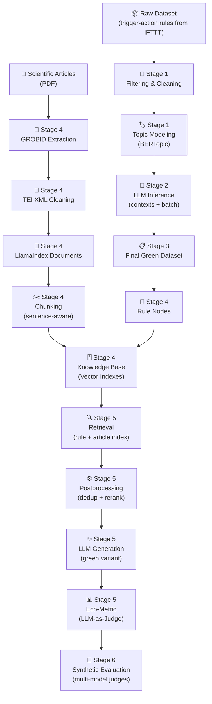

# 🌿 Green Rule RAG

A **Retrieval-Augmented Generation (RAG)** system for generating sustainable variants of trigger-action rules in the smart home domain.

Given a home automation rule expressed in natural language (e.g., *"IF You exit from home THEN Turn off lights"*), the system retrieves relevant knowledge from a knowledge base built on scientific articles and pre-catalogued green rules, generates a more sustainable version of the original rule, and evaluates its quality through a structured eco-metric.

---

## Table of Contents

- [Pipeline Overview](#pipeline-overview)
- [Project Architecture](#project-architecture)
- [Repository Structure](#repository-structure)
- [Stage 1 — Dataset Cleaning](#stage-1--dataset-cleaning)
- [Stage 2 — LLM Inference](#stage-2--llm-inference)
- [Stage 3 — Final Dataset](#stage-3--final-dataset)
- [Stage 4 — Knowledge Base Construction](#stage-4--knowledge-base-construction)
- [Stage 5 — RAG Pipeline](#stage-5--rag-pipeline)
- [Stage 6 — Evaluation](#stage-6--evaluation)
- [Data](#data)
- [Technology Stack](#technology-stack)
- [Installation](#installation)
- [Configuration](#configuration)

---

## Pipeline Overview



---

## Project Architecture

The project is organized into **6 sequential stages**, each corresponding to a folder in `src/`:

| Stage | Folder | Purpose |
|-------|--------|---------|
| 1 | `cleaning` | Filtering the raw dataset, topic modeling with BERTopic, splitting into topic batches |
| 2 | `inference` | LLM inference to generate topic-level contexts and annotate each rule (green relevance, IF-THEN rewriting) |
| 3 | `final_rule_dataset` | Assembling the final green rule dataset (filtering by relevance, deduplication) |
| 4 | `extract_text` | Extracting text from PDFs (GROBID), TEI cleaning, document/node construction, chunking, vector indexing |
| 5 | `generation` | Full RAG pipeline: retrieval, postprocessing (dedup + rerank), LLM generation, eco-metric evaluation |
| 6 | `evaluation` | Synthetic benchmark: batch generation over synthetic rules and multi-model LLM-as-Judge evaluation |

---

## Repository Structure

```
smart-home-green-rag/
├── src/
│   ├── cleaning/
│   │   └── split_topics_into_batches.py
│   ├── inference/
│   │   ├── generate_topic_contexts.py
│   │   ├── infer_topic_batches.py
│   │   ├── prompt_context.txt
│   │   └── prompt_batch.txt
│   ├── final_rule_dataset/
│   │   └── build_final_green_dataset.py
│   ├── extract_text/
│   │   ├── extract_grobid.py
│   │   ├── clean_grobid_tei.py
│   │   ├── build_documents.py
│   │   ├── build_nodes.py
│   │   ├── build_rules_nodes.py
│   │   ├── build_knowledge_base.py
│   │   ├── build_vector_indexes.py
│   │   └── visualize_knowledge_base.py
│   ├── generation/
│   │   ├── run_rag_pipeline.py
│   │   └── rag_pipeline/
│   │       ├── config.py
│   │       ├── clients.py
│   │       ├── retrieval.py
│   │       ├── postprocessing.py
│   │       ├── generation.py
│   │       ├── eco_metric.py
│   │       ├── display.py
│   │       ├── run_io.py
│   │       ├── node_utils.py
│   │       ├── pipeline.py
│   │       ├── judge_prompt.txt
│   │       └── judge_schema.json
│   └── evaluation/
│       ├── run_generations.py
│       └── run_judges.py
├── notebooks/
│   ├── 01-Cleaning/
│   │   ├── 01_raw_dataset_filtering.ipynb
│   │   └── 02_topic_modeling_bertopic.ipynb
│   └── eco_metric_validation_notebook.ipynb
├── data/
│   ├── dataset-rules/
│   │   ├── raw/                 # Original IFTTT dataset
│   │   ├── processed/           # Filtered and clustered dataset
│   │   ├── taxonomies/          # Channel classification taxonomies
│   │   ├── batch/               # Topic batches (LLM input)
│   │   ├── final_batch/         # LLM output with contexts and annotations
│   │   └── final_dataset/       # Final green dataset + rule nodes
│   ├── articles/
│   │   ├── pdfs/                # Scientific article PDFs
│   │   ├── articles-metadata/   # Per-article JSON metadata
│   │   ├── extracted_grobid_tei/# TEI XML from GROBID
│   │   ├── cleaned_blocks/      # Cleaned JSONL blocks
│   │   ├── supplementary_blocks/# Supplementary blocks (glossaries, boxes)
│   │   ├── table_blocks/        # Extracted tables
│   │   ├── discarded_blocks/    # Discarded blocks (diagnostics)
│   │   ├── review_blocks/       # Blocks flagged for manual review
│   │   ├── cleaning_reports/    # Per-article cleaning reports
│   │   ├── documents_preview/   # LlamaIndex document previews
│   │   └── nodes_preview/       # Chunk node previews
│   ├── knowledge_base/
│   │   ├── article_index/       # Vector index for article chunks
│   │   ├── rule_index/          # Vector index for green rules
│   │   ├── reports/             # KB construction reports
│   │   └── visualizations/      # 3D embedding visualizations
│   ├── retrieval_runs/          # Per-run RAG output (JSON)
│   └── synthetic_evaluation/    # Synthetic benchmark dataset & experiments
│       ├── synthetic_green_rules_360.jsonl
│       └── exp_001/
│           ├── generations.jsonl
│           └── judges/          # Per-judge-model results
├── utils/
│   ├── dataset_group_by.py
│   └── convert_excel_to_jsonl.py
├── requirements.txt
└── README.md
```

---

## Stage 1 — Dataset Cleaning

**Goal**: Filter and organize relevant smart home rules from the raw IFTTT trigger-action dataset, grouping them by topic.

### Process

1. **Raw dataset filtering** (`notebooks/01-Cleaning/01_raw_dataset_filtering.ipynb`)
   - Loads the raw dataset (`data/dataset-rules/raw/dataset_raw.csv`)
   - Maps channels using a taxonomy (`channel_class_mapping.csv`)
   - Classifies rules into three scopes: `core_smart_home`, `context_aware_smart_home`, `smart_home_related`
   - Filters out non-relevant rules
   - Output: `data/dataset-rules/processed/dataset_candidates_rag.csv`

2. **Topic modeling with BERTopic** (`notebooks/01-Cleaning/02_topic_modeling_bertopic.ipynb`)
   - Thematic clustering via BERTopic
   - Assigns topic ID and topic name to each rule

3. **Splitting into topic batches** (`src/cleaning/split_topics_into_batches.py`)
   - Generates stable sample IDs (`T024_S0001`) and topic IDs (`T024`)
   - Splits into batches of up to 100 rules per topic
   - Exports only the columns needed for LLM inference: `sample_id`, `topic_name`, `topic_text`
   - Output: `data/dataset-rules/batch/topic_*/topic_*_batch_*.csv` + manifest

---

## Stage 2 — LLM Inference

**Goal**: Enrich the dataset with structured annotations via LLM (GPT-4o-mini via OpenRouter): topic context, IF-THEN rewriting, green relevance, and inclusion decision.

### Process

1. **Topic-level context generation** (`src/inference/generate_topic_contexts.py`)
   - For each BERTopic cluster, samples N representative rules
   - The LLM analyzes the samples and produces a stable context:
     - `llm_topic_name` — functional topic name
     - `topic_summary` — description of the topic content
     - `green_category` — green category in snake_case (e.g., `hvac_optimization`)
     - `global_green_relevance` — global green relevance: `high`, `medium`, `low`, `none`
   - Output validated via JSON Schema
   - Output: `data/dataset-rules/final_batch/topic_*/topic_*_context.json`

2. **Per-rule batch inference** (`src/inference/infer_topic_batches.py`)
   - For each rule in the batch, using the topic context:
     - Rewrites the rule in clean IF-THEN format
     - Assigns per-rule `green_relevance`
     - Decides `keep_for_rag`: true/false
   - Output: `data/dataset-rules/final_batch/topic_*/topic_*_batch_*.json`

### Prompts
- **Context prompt** (`prompt_context.txt`): defines green relevance criteria and topic-level analysis instructions
- **Batch prompt** (`prompt_batch.txt`): defines IF-THEN rewriting and per-rule classification instructions

### Model
- **Model**: `openai/gpt-4o-mini` (via OpenRouter) — temperature: 0, strict JSON Schema output

---

## Stage 3 — Final Dataset

**Goal**: Assemble the final green rule dataset, keeping only rules with `medium` or `high` relevance and deduplicating them.

### Process (`src/final_rule_dataset/build_final_green_dataset.py`)
1. Collects all batch JSON files from `data/dataset-rules/final_batch/`
2. Filters rules with `green_relevance` ∈ {`medium`, `high`}
3. Exact deduplication on the `if_then_rule` column
4. Final columns: `sample_id`, `llm_topic_name`, `green_category`, `if_then_rule`
5. Output: `data/dataset-rules/final_dataset/green_rules_final_dataset.json`

### Green Categories
The 9 normalized green categories used in the project:

| Category | Description |
|----------|-------------|
| `lighting_efficiency` | Lighting optimization |
| `occupancy_based_control` | Occupancy/presence-based control |
| `hvac_optimization` | Heating/cooling optimization |
| `appliance_energy_management` | Appliance energy management |
| `environmental_awareness` | Environmental awareness (sensors, weather) |
| `comfort_security` | Comfort and security |
| `water_saving` | Water saving |
| `scheduling_optimization` | Scheduling optimization |
| `standby_reduction` | Standby consumption reduction |

---

## Stage 4 — Knowledge Base Construction

**Goal**: Extract text from scientific articles (PDF), clean it, chunk it, and build the vector indexes of the knowledge base.

### Article Sub-pipeline

#### 4a. GROBID Extraction (`src/extract_text/extract_grobid.py`)
- Sends article PDFs to a local GROBID server (`http://localhost:8070`)
- Extracts enriched TEI XML with PDF coordinates, sentence segmentation, and generated XML IDs
- Output: `data/articles/extracted_grobid_tei/*.grobid.tei.xml`

#### 4b. TEI Cleaning (`src/extract_text/clean_grobid_tei.py`)
- **Block classification**: each paragraph is classified as `main`, `supplementary`, `discard`, or `review`
- **Filters applied**: removal of administrative sections (references, acknowledgments, etc.), editorial boilerplate, figure/table captions, graph text; detection of table leakage; separation of supplementary blocks (glossaries, highlights, case studies)
- **Text normalization**: Unicode NFKC, soft hyphen removal, whitespace collapsing
- **Abstract selection**: multi-criteria scoring algorithm for multiple/ambiguous abstracts
- Output: `cleaned_blocks/*.jsonl`, `supplementary_blocks/*.jsonl`, `cleaning_reports/*.json`

#### 4c. Document Construction (`src/extract_text/build_documents.py`)
- Builds `Document` objects (LlamaIndex) from cleaned JSONL blocks
- Integrates article metadata (`articles-metadata/*.json`): title, year, URL, summary, green categories one-hot encoding (9 categories)
- Configures metadata keys excluded from embedding and LLM context

#### 4d. Chunking — Node Construction (`src/extract_text/build_nodes.py`)
- Groups blocks by article section
- Creates one LlamaIndex `Document` per section with hierarchical `header_path`
- Sentence-aware splitting via `SentenceSplitter` (chunk size: 512 tokens, overlap: 64 tokens)
- Each node retains: section metadata, article position, source pages, prev/next chunk links

### Rule Sub-pipeline

#### 4e. Rule Nodes (`src/extract_text/build_rules_nodes.py`)
- Loads the normalized green dataset (`green_rules_final_dataset_normalized.json`)
- Builds one LlamaIndex `TextNode` per rule with text format: `Green category: X\nTopic: Y\nRule: IF ... THEN ...`
- Metadata includes: `content_type=green_rule`, `rule_id`, `llm_topic_name`, `green_category`, green categories one-hot
- Node ID deduplication
- Output: `data/dataset-rules/final_dataset/rule_nodes.jsonl`

### Vector Indexing

#### 4f. Knowledge Base Builder (`src/extract_text/build_knowledge_base.py`)
Orchestrator script that runs the entire pipeline in-memory:
1. Builds article documents and chunk nodes with green metadata
2. Builds rule nodes
3. Creates two separate vector indexes:
   - **Article Index**: scientific article chunks → `data/knowledge_base/article_index/`
   - **Rule Index**: green rules → `data/knowledge_base/rule_index/`
4. **Embedding model**: `intfloat/e5-base-v2` (HuggingFace, local)

#### 4g. Visualization (`src/extract_text/visualize_knowledge_base.py`)
- Dimensionality reduction of embeddings (UMAP or PCA) to 3D
- Interactive Plotly visualization colored by `green_category`, `source`, or `content_type`
- Output: interactive HTML + CSV + JSON report → `data/knowledge_base/visualizations/`

---

## Stage 5 — RAG Pipeline

**Goal**: Given a trigger-action rule as input, retrieve relevant context from the knowledge base, generate an improved green variant, and evaluate it with the eco-metric.

### Entry Point
`src/generation/run_rag_pipeline.py` → `rag_pipeline/pipeline.py`

The full pipeline runs in **4 phases**:

#### 5a. Retrieval (`rag_pipeline/retrieval.py`)
- Loads persisted vector indexes (article + rule)
- Similarity retrieval from the query:
  - **Rule Index** → top-k similar rules (default: k=10)
  - **Article Index** → top-k article chunks (default: k=15)
- **Embedding model**: `intfloat/e5-base-v2`

#### 5b. Postprocessing (`rag_pipeline/postprocessing.py`)
- **Rules**: textual deduplication with SequenceMatcher (threshold: 0.88) → top-3 selection
- **Articles**:
  - Removal of chunks shorter than 150 characters
  - **Reranking** with cross-encoder `cross-encoder/ms-marco-MiniLM-L-6-v2`
  - Top-5 selection after reranking

#### 5c. Generation (`rag_pipeline/generation.py`)
- Builds the RAG prompt with: original rule, selected similar rules, selected article chunks
- Calls the LLM via **Ollama Cloud** (model: `gpt-oss:20b`, temperature: 0.2)
- Structured JSON output:
  ```json
  {
    "original_rule": "IF You exit from home THEN Turn off lights.",
    "improved_rule": "IF You exit from home AND no one else is home THEN Turn off all lights and reduce thermostat to eco mode.",
    "green_strategy": "occupancy_based_shutdown",
    "preserved_intent": true,
    "explanation": "...",
    "used_context_ids": ["RULE_1", "ARTICLE_2"]
  }
  ```

#### 5d. Eco-Metric Evaluation (`rag_pipeline/eco_metric.py`)
After generation, the pipeline automatically evaluates the rule pair (original vs. generated) using an **LLM-as-Judge** approach:

- A judge LLM (default: `gemma4:31b-cloud` via Ollama Cloud) scores both the original and generated rule on **6 feature scores** + **2 validity checks**
- Feature scores and validity checks are defined by a JSON schema (`judge_schema.json`) and guided by a system prompt (`judge_prompt.txt`)

| Feature Score | Range | Description |
|---------------|-------|-------------|
| `OccupancyScore` | 0–2 | Use of presence/occupancy information |
| `EnvConditionScore` | 0–1 | Use of environmental conditions (light, temperature, weather) |
| `DurationScore` | 0–1 | Presence of auto-off or time limit |
| `SchedulingScore` | 0–2 | Time scheduling, off-peak hours |
| `StandbyScore` | 0–2 | Anti-waste standby logic |
| `ApplianceScore` | 0–2 | Smart appliance energy management |

| Validity Check | Values | Description |
|----------------|--------|-------------|
| `IntentPreserved` | 0/1 | The variant preserves the functional intent |
| `ComfortSafetyPenalty` | 0/1 | The variant introduces comfort/safety risks |

**Deterministic Eco-Metric Computation** (computed by the script, not the LLM):

```
S_awareness = 0.6 × (OccupancyScore / 2) + 0.4 × (EnvConditionScore / 1)
S_energy    = 0.4 × (DurationScore / 1) + 0.4 × (StandbyScore / 2) + 0.1 × (ApplianceScore / 2) + 0.1 × (SchedulingScore / 2)

Δ_awareness = S_awareness(r') − S_awareness(r)
Δ_energy    = S_energy(r') − S_energy(r)

EcoStatic   = 0.5 × Δ_awareness + 0.5 × Δ_energy
```

**Classification Labels**:

| Label | Condition |
|-------|-----------|
| `reject` | `IntentPreserved = 0` or `ComfortSafetyPenalty = 1` or `EcoStatic ≤ 0` |
| `accept` | `EcoStatic > 0` (mild improvement) |
| `strong_green` | `EcoStatic ≥ 0.2` (significant improvement) |

Each run is saved in `data/retrieval_runs/run_XXX/` with four JSON files: retrieval, postprocessing, generation, and eco-metric results.

---

## Stage 6 — Evaluation

**Goal**: Run the full RAG pipeline at scale over a synthetic benchmark dataset and evaluate the generated rules using multiple LLM judges.

### Synthetic Benchmark Dataset
A curated dataset of 360 synthetic trigger-action rules (`data/synthetic_evaluation/synthetic_green_rules_360.jsonl`) with fields: `rule_id`, `target_category`, `difficulty`, `original_rule`.

### Process

#### 6a. Batch Generation (`src/evaluation/run_generations.py`)
- Iterates over the synthetic dataset and runs the RAG pipeline (retrieve → postprocess → generate) for each rule
- Supports resume: skips already-processed `rule_id`s
- Output: `data/synthetic_evaluation/exp_XXX/generations.jsonl`
- Failures saved separately to `generation_failures.jsonl`

#### 6b. Multi-Model LLM-as-Judge (`src/evaluation/run_judges.py`)
- Evaluates each generated rule using the eco-metric judge
- **Supports multiple providers**: Ollama (local/cloud) and OpenRouter
- **Supports multiple judge models** per experiment (each writes to its own subfolder)
- For OpenRouter models, uses strict JSON Schema via `response_format`
- **Resume support**: skips already-judged records
- **Invalid detection**: rules where `IntentPreserved=0` or `ComfortSafetyPenalty=1` are flagged for regeneration

Output structure:
```
data/synthetic_evaluation/exp_001/
├── generations.jsonl
└── judges/
    ├── openrouter_openai_gpt_4o_mini/
    │   ├── judgments.jsonl
    │   ├── failures.jsonl
    │   ├── invalid_generations.jsonl
    │   └── invalid_rule_ids.txt
    ├── openrouter_qwen_qwen3_32b/
    └── openrouter_mistralai_mistral_small_3_2_24b_instruct/
```

#### 6c. Eco-Metric Validation (`notebooks/eco_metric_validation_notebook.ipynb`)
- Validates schema compliance and independently recomputes EcoStatic and labels
- Statistical analysis: label distribution, EcoStatic distribution, per-feature means, deltas
- Cross-judge agreement analysis

---

## Data

### Rule Dataset
- **Source**: trigger-action rules derived from IFTTT
- **Raw dataset**: `data/dataset-rules/raw/dataset_raw.csv`
- **Final green dataset**: `data/dataset-rules/final_dataset/green_rules_final_dataset.json`
  - Only rules with green relevance `medium` or `high`, deduplicated and normalized

### Scientific Articles
- 19 articles (documented in `data/articles/ARTICLES.md`)
- Topics covered: smart home energy sustainability, domestic energy management (HVAC, lighting, appliances), consumer behavior and energy savings, green IoT and home automation, sustainable household practices

### Knowledge Base
Two separate vector indexes in `data/knowledge_base/`:
- **Article Index** — scientific article chunks enriched with green metadata
- **Rule Index** — normalized green trigger-action rules

### Synthetic Evaluation
- **Benchmark dataset**: 360 synthetic rules across 9 green categories and 3 difficulty levels
- **Experiment results**: per-model generations and multi-judge evaluations

---

## Technology Stack

| Component | Technology |
|-----------|------------|
| **Embedding** | `intfloat/e5-base-v2` (HuggingFace, local) |
| **Reranking** | `cross-encoder/ms-marco-MiniLM-L-6-v2` |
| **Vector Store & RAG** | LlamaIndex |
| **Generation (rule inference)** | GPT-4o-mini (via OpenRouter) |
| **Generation (RAG)** | Ollama Cloud (`gpt-oss:20b`) |
| **Eco-Metric Judge (pipeline)** | `gemma4:31b-cloud` (via Ollama Cloud) |
| **Evaluation Judges** | GPT-4o-mini, Qwen3-32B, Mistral Small 3.2 24B (via OpenRouter) |
| **PDF Extraction** | GROBID |
| **Topic Modeling** | BERTopic |
| **Clustering** | HDBSCAN |
| **Dimensionality Reduction** | UMAP |
| **Visualization** | Plotly |
| **NLP** | NLTK, Sentence-Transformers, Transformers |
| **Data Processing** | Pandas, NumPy, scikit-learn |
| **Environment** | Python 3.11+, dotenv |

---

## Installation

```bash
# Clone the repository
git clone https://github.com/rosacarota/smart-home-green-rag.git
cd smart-home-green-rag

# Create and activate a virtual environment
python -m venv venv
source venv/bin/activate        # Linux/macOS
venv\Scripts\activate           # Windows

# Install dependencies
pip install -r requirements.txt
```

### External Requirements
- **GROBID** (for PDF extraction): local server on `http://localhost:8070`
  ```bash
  docker run --rm -p 8070:8070 lfoppiano/grobid:0.8.1
  ```
- **Ollama Cloud**: for RAG generation and eco-metric judge (requires API key)

---

## Configuration

### Environment Variables
Create a `.env` file in the project root:
```env
OLLAMA_API_KEY=your_ollama_api_key      # API key for Ollama Cloud (Stage 5 generation + eco-metric judge)
OPEN_ROUTER_KEY=your_openrouter_key     # API key for OpenRouter (Stage 2 inference + Stage 6 judges)
```

### Main Parameters
RAG pipeline parameters are configurable in `src/generation/rag_pipeline/config.py`:

| Parameter | Default | Description |
|-----------|---------|-------------|
| `TOP_K_RULES` | 10 | Rules retrieved from the rule index |
| `TOP_K_ARTICLES` | 15 | Article chunks retrieved |
| `FINAL_RULES_K` | 3 | Rules selected after postprocessing |
| `FINAL_ARTICLES_K` | 5 | Chunks selected after reranking |
| `RULE_DEDUP_SIMILARITY_THRESHOLD` | 0.88 | Threshold for rule deduplication |
| `LLM_TEMPERATURE` | 0.2 | Temperature for RAG generation |
| `ECO_JUDGE_MODEL_NAME` | `gemma4:31b-cloud` | Default eco-metric judge model |
| `ECO_JUDGE_TEMPERATURE` | 0.0 | Judge temperature (deterministic) |

---
